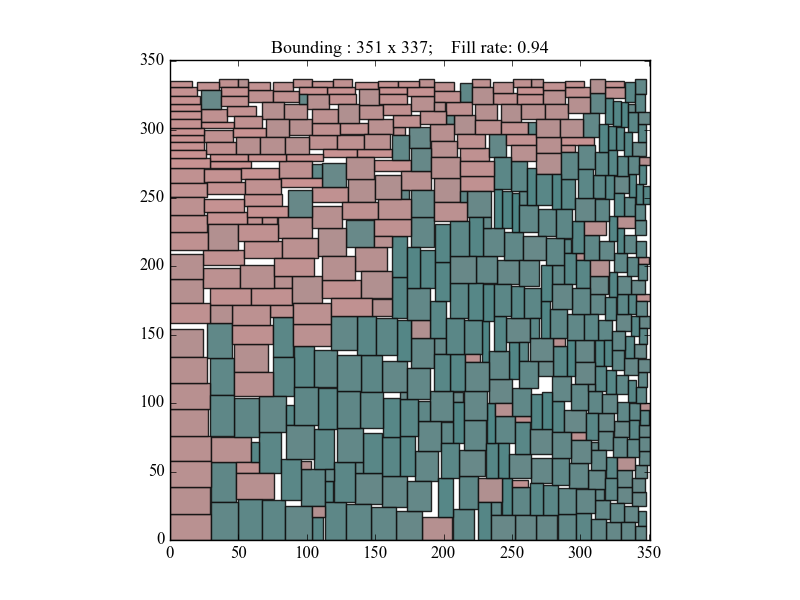

# Rectangle packing solver

This is a effective solver for 2D-rectangle-packing problem, which can find potential usage in various fields.

### Problem description
It is formalized as a typical optimization problem within such framework:

| Item | Setting |
|---|---|
| *Input* | • A set of 2D rectangles    |
| *Output* | • A complete arrangement of these rectangles in a 2D space |
| *Constraints* | • Each rectangle is aligned to X and Y axis of the space.   • No overlapping is allowed. |
| *Objective* | • Minimize the area of the axis-aligning bounding box covering all rectangles. |
| *Extension* |• Any rectangle can be replaced with its 90°-rotated version. |

### Analogy ###
It is like given a large piece of cloth and required is a set of small pieces for some assembling work. The objective is to cut off these required pieces with least consumption of the large cloth.

### Short explanation ###
In this implementation the greedy method is applied for its satisfying effect. Further optimization schemes can be explored by making use of the adapt this model to interface with some optimizer's settings.

## Sample output

As a simple example, an arrangement for 500 random generated rectangles is delivered by this solver, plotted with `pyplot`:

    

With fill rate (aka. occupancy rate) more than 90% almost averagely, the results seem highly satisfying (w.R.t. the random generation of rectangle edge length with independent uniform distribution).

The killer heuristics therein is the choice of the state assessment function to be the *sum of width and height* of the bouding box (rather than the bounding *area*!) resulted from the action of installing a rectangle. Rigorous proof is yet to be found.

## Highlight of this approach
- No utilities from computational graphics or computational geometry are used, since the underlying data structure resembles a Threaded-Tree, which is more abstract.
- With this structure, spatial restrictions can be detected by simple arithmetics, rather than applying geometric algorithms.
- This approach sacrifices completeness of by considering stacking direction merely upwardsrightwards. However, the results seem satisfying.
- Much more performant implementation can be derived from this Python implementation with no dependencies required.

## Restrictions and TODOs

- When many rectangles are of the same size, which is the degeneracy case, the model suffers from the disability of arranging them like a "grid".

<!-- - In this unbounded space, it seems there exists a tendency to arrange rectangles along the X or Y axis for some input with rectangles of near sizes. Though the quantitative result looks good, but setting constraints about boundaries should be made available to make the resulted bounding area more like a square.

-->

<!--
## Detailed approach of solving
- The model is implemented with an abstract data structure resembling the *threaded-tree*
- Incrementally, a rectangle is installed to a corner and new corners get generated by such installation. Then the new corners (only top-left corner and bottom-right corner of this rectangle are included for simplicity) are treated as children of the just used corner, which is their parent in the *tree*
- The corner object is abstracted by the object *Turning*
- There are *convex* and *concave* turnings
- Each *Turning* is associated with four pointers, pointing left/right/up/down directions. Such information is used to detect spatial restrictions affecting the feasible size of rectangle which can be installed onto this turning
- When a rectangle is installed onto a convex turning, it is "slided" left (when at upleft turning) or downwards (when at downright turning) until hitting any installed rectangle or the boundary. Such installation two new corners into the current thread and a brand new "inner thread" into the model
- When a rectangle is installed onto a concave turning, merely the new corners are inserted into the current thread
- The spatial restriction at a turning for installing a rectangle is heuristically calculated by multiplying the distance between the left/right pointer's targets as well as the distance between the up/down pointer's targets
- With **greedy** method, which seems highly profiting
-->