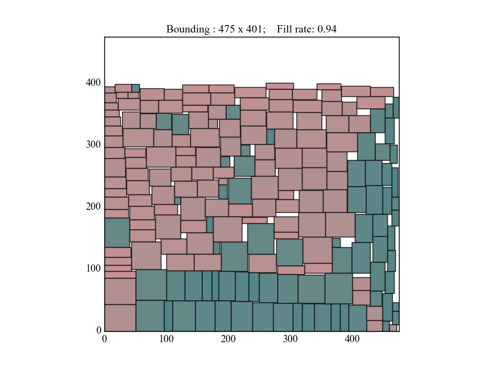

repacker
=====

`repacker` is a highly effective solver for 2D-rectangle-packing problem (which is tricky to solve straighforwardly) supported by compact data structures and helpful heuristics.

## First view

Given a set of 200 (random-generated) rectangles, `repacker` delivers an optimized packing plan like:

<p>
	
</p>

or with even more rectangles, say 500:

<p>
	
</p>

The fill-rate denotes how much we have made use of the space inside the bounding box. By some testing of this module, the fill-rate is averagely above 93% for various inputs<sup>[1]</sup>.

<sub>[1]. Except when the sizes of many rectangles are same, which is the degeneracy case to be fixed in the future. </sub>


## Usage

This module can be used through command-line

```
python repacker.py my_rects
```

where `my_rects` is a file with multiple lines and each line is two integers seperated by space.

The outputs is generated into file `my_rects_out` and shown by figure `my_rects_out.png` (see example file `my_rect_100`).

Alternatively, usage can be interactive like in [`InteractiveUsage.ipynb`](./InteractiveUsage.ipynb).


## Problem revisited

The 2D-rectangle-packing problem targeted here can be formalized as

| Item | Setting |
|---|---|
| *Input* | • A set of 2D rectangles <br/>  |
| *Output* | • Arrangement of all these rectangles in a 2D space |
| *Constraints* | • Each rectangle is aligned to X and Y axis of the space. <br/> • No overlapping is allowed. |
| *Objective* | • Minimize the area of the axis-aligning bounding box covering all rectangles. |
| *Extension* |• Any rectangle can be replaced with its 90°-rotated version. |

The solution to this problem may find usage in various fields. For example, given a large plate of steel, we may be required to slice it into small rectangle pieces for future assembling work according to some engineering plot and hope to use this plate most economically.


## Approach

Supported by a Threaded-Tree like data structure, the killer heuristics for this solver is the assessment function `F` guiding installation of each rectangle `r` at potential position `c` during the greedy-installation process:

```
F(r, c) = B.width + B.height
```

where `B` is the new bounding box induced by the installation `(r, c)`. <sup>[2]</sup>

<sub>[2]. Note the *objective function* to be minimized is `B.area == B.width * B.height`, which is different from `F`.</sub>

A possible interpretation for the benifit of such assessment `F` is that using `B.area` instead may lead to the rectangle stack to grow like a long band, rather than grow like a square. Suppose we have already a "long" bounding box `B` where `B.height` is much greater than `B.width` and we are to install a rectangle `r` with roughly the size `d`, then installing `r` on the short side we get the rough increment of area

```
Δ(B.area) == d * B.height
```

which is much greater than installing on the short side where

```
Δ(B.area) == d * B.width
```

Consequently, following `r`s tend to always be installed on the long side when using `B.area` as the assessment function, so that the increment of objective value can be less.

On the other side, with assessment `F` above, the increment becomes roughly

```
ΔF == d
```

no matter `r` is installed on the short or long side. This avoids the "long-band" problem using `B.area` and provides more spatial choices for rest installations with a square-like rectangle stack.


<!--
 That is, for a long-band-like stack,  an installation of new rectangle on the short side comprises a much greater increment of the bounding area than on the long side. Consequently the rest of rectangles tend to be installed further along the long side.

On the other side, the above `F` avoids such problem by treating installation on long/short side almost equally.
-->

## Characteristics of this solver

- No utilities from computational graphics or computational geometry are used, since the underlying data structure resembles a Threaded-Tree, which is more abstract.
- With this structure, spatial restrictions can be detected by simple arithmetics, rather than applying geometric algorithms.
- This approach sacrifices completeness of by considering stacking direction merely upwardsrightwards. However, the results seem satisfying.
- Much more performant implementation can be derived from this Python implementation with no dependencies required.


## Restrictions and TODOs

- When many rectangles are of the same size, which is the degeneracy case, the model suffers from the disability of arranging them like a "grid". The fix requires clear definition for how to compute space restrictions and how to maintain the "Thread" when such cases raise.

<!-- - In this unbounded space, it seems there exists a tendency to arrange rectangles along the X or Y axis for some input with rectangles of near sizes. Though the quantitative result looks good, but setting constraints about boundaries should be made available to make the resulted bounding area more like a square.

-->

<!--
## Detailed approach of solving
- The model is implemented with an abstract data structure resembling the *threaded-tree*
- Incrementally, a rectangle is installed to a corner and new corners get generated by such installation. Then the new corners (only top-left corner and bottom-right corner of this rectangle are included for simplicity) are treated as children of the just used corner, which is their parent in the *tree*
- The corner object is abstracted by the object *Turning*
- There are *convex* and *concave* turnings
- Each *Turning* is associated with four pointers, pointing left/right/up/down directions. Such information is used to detect spatial restrictions affecting the feasible size of rectangle which can be installed onto this turning
- When a rectangle is installed onto a convex turning, it is "slided" left (when at upleft turning) or downwards (when at downright turning) until hitting any installed rectangle or the boundary. Such installation two new corners into the current thread and a brand new "inner thread" into the model
- When a rectangle is installed onto a concave turning, merely the new corners are inserted into the current thread
- The spatial restriction at a turning for installing a rectangle is heuristically calculated by multiplying the distance between the left/right pointer's targets as well as the distance between the up/down pointer's targets
- With **greedy** method, which seems highly profiting
-->