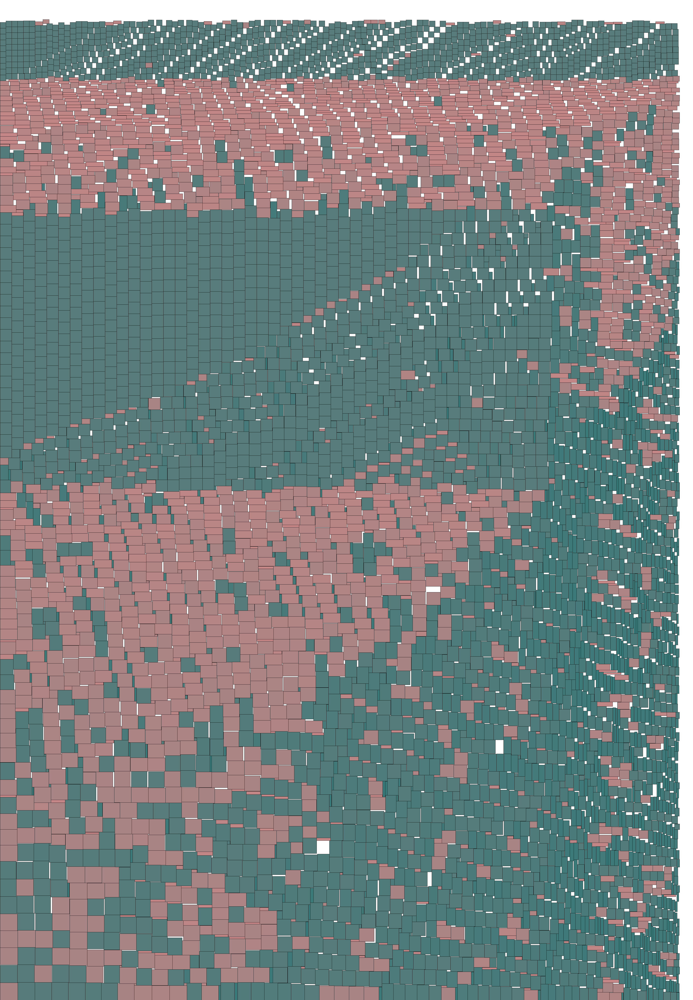

repacker
=====

`repacker` is a highly effective solver for 2D-rectangle-packing problem  supported by linearized data structure and helpful heuristics.

<!-- In short, the packing problem requires to give a plan of placing rectangles in a 2D space, edges aligned, targeting the minimum bounding-box area. -->

#### Problem revisited

The 2D-rectangle-packing problem targeted here can be literally formalized as

| Item | Setting |
|---|---|
| *Input* | • A set of 2D rectangles <br/>  |
| *Output* | • Arrangement of all these rectangles in a 2D space |
| *Constraints* | • Each rectangle is aligned to X and Y axis of the space. <br/> • No overlapping is allowed. |
| *Objective* | • Minimize the area of the axis-aligning bounding box including all these rectangles. |

The term *occupancy rate* denotes how much space inside the bounding box is filled by rectangles. It corresponds to exactly one objective value since the sum of rectangle areas are constant as given.

<!-- This may be tricky to solve straighforwardly. -->

## First view

Given a set of 200 (random-generated) rectangles, `repacker` delivers a highly optimized packing plan like:

<p>
	
</p>

with 93.92% occupancy rate. Similarly, with even more rectangles, say 1000:

<p>
	
</p>

<!-- <sup>[1]</sup>. -->

<!-- <sub>[1]. Except when the sizes of many rectangles are same, which is the degeneracy case to be fixed in the future. </sub>
 -->


solution achieves 95.62% occupancy rate.


By some testing of this module, this rate ranges averagedly about 90% for various inputs with size more than 50.


## Performance

The identical optimization scheme has been also implemented in *C++* for speedup, which gives a packing for ca. 6000 rectangles in ca. 10s time (many of them are of the same size and such degenerancy is properly handled, though not perfect).

<p>
    
</p>

The performance of C++ seems blading, however the plotting functionality in C++ is still being experimented.


## Usage

This module can be used through command-line

```
python repacker.py <input-file> [<output-file>] [-n]
```

where

- `<input-file>` is text file as a list of 2-tuples in Python syntax. The name

- `<output-file` would be a name for the generated solution file, which is also a Python list in text. Auto-naming happens when it is not explicitly given (s. examples).

- `-n` means generating no figure for showing the solution.


* No 3rd-party module is required for solving, but module `PIL` is required for drawing the results like the figures above.


## Features of this solver

- No utilities from computational graphics or computational geometry are used, since the underlying data structure is indeed a list. I personally name it *threaded quad-pointers*, which is a 1D linking of all *corners*.
- With this structure, spatial restrictions can be detected by simple arithmetics, rather than applying geometric algorithms.
- The complexity is roughly O(N²). In pure Python, input with 1000 rectangles can be solved within several seconds.
- The heuristical approach for deciding optimal placement can be categorized as a combination of strategies of *Greedy*, *Bottom-Left*, *Best-Fit* etc, which have been explored by various literatures extensively.

<!--
- More performant implementation can be derived from this Python implementation with no language-specific .
-->


<!-- | *Extension* |• Any rectangle can be replaced with its 90°-rotated version. | -->

The solution to this problem may find usage in various fields. For example, given a large plate of steel, we may be required to slice it into small rectangle pieces for future assembling work according to some engineering plot and hope to use this plate most economically.


## Approach details

### Objective value representing the bounding

Supported by this *threaded quad-pointers* data structure, the killer heuristics for this solver is the assessment function `F` guiding installation of each rectangle `r` at potential position `c` during the greedy-installation process:

```
F(r, c) = B.width + B.height
```

where `B` is the new bounding box induced by the placement `(r, c)`<sup>※</sup>.

<sub>※. Note the *objective function* to be minimized is `B.area == B.width * B.height`, which is different from `F`.</sub>

A possible interpretation for the benifit of such assessment `F` is that using `B.area` instead may lead to the rectangle stack to grow like a long band, rather than grow like a square. Suppose we have already a "long" bounding box `B` where `B.height` is much greater than `B.width` and we are to install a rectangle `r` with roughly the size `d`, then installing `r` on the short side we get the rough increment of area

```
Δ(B.area) == d * B.height
```

which is much greater than installing on the short side where

```
Δ(B.area) == d * B.width
```

Consequently, following `r`s tend to always be installed on the long side when using `B.area` as the assessment function, so that the increment of objective value can be less.

On the other side, with assessment `F` above, the increment becomes roughly

```
Δ(F) == d
```

no matter `r` is installed on the short or long side. This avoids the "long-band" problem by using `B.area` and provides more spatial choices for rest installations with a square-like rectangle stack.


### Ordinal combination of further tie-breakers

Since there may be multiple placements of one rectangle resulting in unchanged bounding value, the second/third objective component may play very important roles. For the purpose of *Best-Fit*:

- Any corner corresponds to a "slot" for placing a rectangle. The fill-rate of such placement matters - the greater the better;

- The absolute coordinate values of placement matters - the closer to the axes the placement happens, the better it is leaving more space for subsequent placements.


There seems no rule-of-thumb to choose potential tie-breakers. It may be assumed the choice should be *adaptive to the distribution of given rectangle sizes*, which is yet to be explored systematically.


<!--
 That is, for a long-band-like stack,  an installation of new rectangle on the short side comprises a much greater increment of the bounding area than on the long side. Consequently the rest of rectangles tend to be installed further along the long side.

On the other side, the above `F` avoids such problem by treating installation on long/short side almost equally.
-->

<!--
## restrictions and todos

- when many rectangles are of the same size, which is the degeneracy case, the model suffers from the disability of arranging them like a "grid". the fix requires clear definition for how to compute space restrictions and how to maintain the "thread" when such cases raise.

 - in this unbounded space, it seems there exists a tendency to arrange rectangles along the x or y axis for some input with rectangles of near sizes. though the quantitative result looks good, but setting constraints about boundaries should be made available to make the resulted bounding area more like a square.

 -->

<!--
## Detailed approach of solving
- The model is implemented with an abstract data structure resembling the *threaded-tree*
- Incrementally, a rectangle is installed to a corner and new corners get generated by such installation. Then the new corners (only top-left corner and bottom-right corner of this rectangle are included for simplicity) are treated as children of the just used corner, which is their parent in the *tree*
- The corner object is abstracted by the object *Turning*
- There are *convex* and *concave* turnings
- Each *Turning* is associated with four pointers, pointing left/right/up/down directions. Such information is used to detect spatial restrictions affecting the feasible size of rectangle which can be installed onto this turning
- When a rectangle is installed onto a convex turning, it is "slided" left (when at upleft turning) or downwards (when at downright turning) until hitting any installed rectangle or the boundary. Such installation two new corners into the current thread and a brand new "inner thread" into the model
- When a rectangle is installed onto a concave turning, merely the new corners are inserted into the current thread
- The spatial restriction at a turning for installing a rectangle is heuristically calculated by multiplying the distance between the left/right pointer's targets as well as the distance between the up/down pointer's targets
- With **greedy** method, which seems highly profiting
-->
